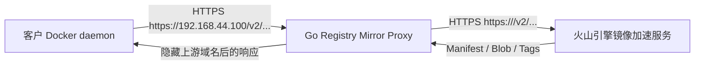

# Docker Registry Mirror Proxy PRD

## 1. 背景

客户环境访问 Docker Hub 官方 Registry 不稳定，直接拉取镜像时经常出现：

```text
访问 https://registry-1.docker.io/v2 超时
```

当前可用方案是在 Docker daemon 中配置火山引擎镜像加速地址：

```json
{
  "registry-mirrors": ["https://<upstream-registry-domain>"]
}
```

该配置可以解决拉取镜像失败问题，但会把真实镜像加速域名暴露给客户。现在需要提供一个自有代理程序，让客户只配置代理服务器 IP：

```json
{
  "registry-mirrors": ["https://192.168.44.100"]
}
```

其中 `192.168.44.100` 是代理程序所在服务器的 IP。代理程序负责转发 Docker Registry V2 请求到：

```text
https://<upstream-registry-domain>
```

客户侧应能正常拉取镜像，并且不感知、不看到真实上游域名。

## 2. 目标

1. 使用 Go 语言实现一个 Docker Registry Mirror 反向代理服务。
2. 客户 Docker daemon 只配置代理服务器地址，例如 `https://192.168.44.100`。
3. 代理服务将请求转发到上游镜像地址 `https://<upstream-registry-domain>`。
4. 支持 Docker 拉取镜像所需的 Registry V2 API 请求。
5. 防止上游域名通过响应头、重定向、错误信息等方式泄露给客户。
6. 提供可配置、可部署、可观测、可排错的服务形态。

## 3. 非目标

1. 第一阶段不实现完整 Docker Registry 存储服务。
2. 第一阶段不主动缓存镜像层数据，只做透明代理。
3. 第一阶段不支持镜像推送 `docker push`，默认只服务拉取链路。
4. 第一阶段不实现多租户管理后台。
5. 第一阶段不替代企业级 Harbor、Distribution Registry 等完整产品。

## 4. 用户与使用场景

### 4.1 客户侧管理员

客户侧管理员只需要配置 Docker daemon：

```json
{
  "registry-mirrors": ["https://192.168.44.100"]
}
```

然后重启 Docker：

```bash
sudo systemctl restart docker
```

之后执行：

```bash
docker pull nginx:latest
docker pull alpine:latest
docker pull library/redis:latest
```

镜像应可以正常拉取。

### 4.2 代理服务运维人员

运维人员在 `192.168.44.100` 服务器上部署代理程序，配置上游镜像地址、监听端口、TLS 证书、日志级别、超时时间等参数。

## 5. 核心需求

### 5.1 Docker Registry V2 兼容

代理服务至少需要支持以下请求类型：

| 类型 | 方法 | 示例路径 | 说明 |
| --- | --- | --- | --- |
| API 探活 | `GET` | `/v2/` | Docker daemon 检测 Registry V2 可用性 |
| Manifest 查询 | `GET`, `HEAD` | `/v2/library/nginx/manifests/latest` | 获取镜像 manifest |
| Blob 查询 | `GET`, `HEAD` | `/v2/library/nginx/blobs/sha256:...` | 获取镜像层 |
| Blob 分段下载 | `GET` | `/v2/.../blobs/sha256:...` with `Range` | 支持断点续传或分段下载 |
| Tag 列表 | `GET` | `/v2/library/nginx/tags/list` | 某些客户端会使用 |

### 5.2 请求转发

代理收到客户请求后，应转发到固定上游：

```text
https://<upstream-registry-domain>
```

转发要求：

1. 保留原始请求路径与查询参数。
2. 保留 Docker 拉取相关请求头，例如：
   - `Accept`
   - `Authorization`
   - `Range`
   - `If-None-Match`
   - `If-Modified-Since`
   - `User-Agent`
3. 转发时将上游请求的 `Host` 设置为 `<upstream-registry-domain>`。
4. 返回响应时保留关键响应头，例如：
   - `Content-Type`
   - `Content-Length`
   - `Docker-Content-Digest`
   - `ETag`
   - `Accept-Ranges`
   - `Content-Range`
   - `WWW-Authenticate`
5. 支持大文件流式转发，不能把完整镜像层读入内存。

### 5.3 上游域名隐藏

代理服务必须避免客户看到：

```text
<upstream-registry-domain>
```

处理要求：

1. 不在响应头中透出上游域名。
2. 不在错误响应 body 中透出上游域名。
3. 对上游返回的 `Location` 头进行处理。
4. 如果上游返回重定向：
   - 优先方案：代理服务在服务端内部跟随重定向，并把最终内容流式返回给 Docker 客户端。
   - 备选方案：将 `Location` 改写为代理服务自身地址，再由代理服务继续转发。
5. 代理日志中可以记录上游域名，但日志不能返回给客户。

### 5.4 HTTPS 与证书

客户配置的是：

```json
{
  "registry-mirrors": ["https://192.168.44.100"]
}
```

因此代理服务必须提供 HTTPS。

重要限制：

1. TLS 证书必须被客户机器信任。
2. 证书的 Subject Alternative Name 必须包含 IP：`192.168.44.100`。
3. 如果不提供被信任且匹配 IP 的证书，Docker daemon 会出现证书校验失败。
4. 不建议让客户配置 `insecure-registries`，除非是临时测试环境。

### 5.5 只读策略

第一阶段默认只允许拉取相关方法：

```text
GET
HEAD
OPTIONS
```

对于推送相关请求，例如：

```text
POST
PUT
PATCH
DELETE
```

默认返回：

```text
405 Method Not Allowed
```

后续如果需要支持推送，应单独设计认证、权限、审计与存储策略。

### 5.6 配置

代理程序应支持配置文件与环境变量。

建议配置项：

| 配置项 | 示例 | 说明 |
| --- | --- | --- |
| `listen_addr` | `:443` | 监听地址 |
| `upstream` | `https://<upstream-registry-domain>` | 上游镜像地址 |
| `tls_cert_file` | `/etc/registry-mirror-proxy/tls.crt` | TLS 证书 |
| `tls_key_file` | `/etc/registry-mirror-proxy/tls.key` | TLS 私钥 |
| `read_timeout` | `30s` | 请求读取超时 |
| `write_timeout` | `0` | 大镜像层下载不应被短写超时中断 |
| `idle_timeout` | `120s` | 空闲连接超时 |
| `upstream_timeout` | `60s` | 上游连接和首包超时 |
| `max_idle_conns` | `512` | 上游连接池 |
| `log_level` | `info` | 日志级别 |
| `hide_upstream_errors` | `true` | 是否隐藏上游错误细节 |
| `allow_methods` | `GET,HEAD,OPTIONS` | 允许的 HTTP 方法 |

### 5.7 日志

日志需要包含：

1. 请求方法。
2. 请求路径。
3. 响应状态码。
4. 响应字节数。
5. 耗时。
6. 客户端 IP。
7. 上游耗时。
8. 错误类型。

日志不应在客户响应中返回。

### 5.8 健康检查

提供本地健康检查接口：

```text
GET /healthz
```

返回：

```json
{"status":"ok"}
```

可选增强：

```text
GET /readyz
```

该接口检查上游 `/v2/` 是否可访问。

## 6. 技术方案

### 6.1 推荐架构



### 6.2 Go 实现方式

推荐使用 Go 标准库实现：

1. `net/http` 提供 HTTPS 服务。
2. `httputil.ReverseProxy` 作为基础反向代理。
3. 自定义 `Rewrite` 或 `Director` 修改请求上游地址与 Host。
4. 自定义 `Transport` 控制连接池、TLS、超时。
5. 自定义 `ModifyResponse` 处理响应头与重定向。
6. 自定义 `ErrorHandler` 隐藏上游错误细节。

### 6.3 重定向处理策略

Docker Registry 或镜像加速服务可能对 Blob 请求返回 `307` 或 `302`，并在 `Location` 中带上真实上游地址或对象存储地址。

为了不暴露域名，第一阶段建议采用服务端内部跟随重定向：

1. 代理收到客户请求。
2. 代理请求上游。
3. 如果上游返回重定向，代理服务内部继续请求 `Location`。
4. 代理把最终内容流式返回客户。
5. 客户始终只看到 `https://192.168.44.100`。

注意事项：

1. 内部跟随重定向时，需要限制最大跳转次数，例如 5 次。
2. 只允许跳转到 HTTPS 地址。
3. 可以允许上游返回的可信对象存储域名，但不返回给客户。
4. 需要保留 `Range` 请求头，保证分段下载可用。

### 6.4 错误处理

客户侧错误响应应尽量通用：

```json
{
  "errors": [
    {
      "code": "UNAVAILABLE",
      "message": "registry mirror upstream unavailable"
    }
  ]
}
```

不能包含上游域名、内部 IP、堆栈信息、配置路径等敏感信息。

## 7. 部署要求

### 7.1 推荐部署方式

第一阶段提供以下交付物：

1. 单个 Go 二进制文件。
2. 示例配置文件。
3. systemd unit 文件。
4. TLS 证书准备说明。
5. Docker daemon 客户侧配置说明。

### 7.2 systemd 服务

建议服务名：

```text
registry-mirror-proxy.service
```

服务启动参数示例：

```bash
/usr/local/bin/registry-mirror-proxy \
  --config /etc/registry-mirror-proxy/config.yaml
```

### 7.3 防火墙

代理服务器需要开放：

```text
TCP 443
```

代理服务器需要能访问：

```text
<upstream-registry-domain>:443
```

## 8. 验收标准

### 8.1 基础拉取

客户机器配置：

```json
{
  "registry-mirrors": ["https://192.168.44.100"]
}
```

执行以下命令成功：

```bash
docker pull alpine:latest
docker pull nginx:latest
docker pull busybox:latest
```

### 8.2 HTTPS 验证

执行：

```bash
curl -vk https://192.168.44.100/v2/
```

应返回 Registry V2 合理响应，不应出现证书名称不匹配问题。测试环境使用自签证书时，客户机器需要导入 CA。

### 8.3 域名隐藏

执行拉取和抓包验证：

```bash
docker pull nginx:latest
```

客户侧不应看到：

```text
<upstream-registry-domain>
```

重点检查：

1. Docker daemon 日志。
2. HTTP 响应头。
3. 重定向 `Location`。
4. 错误响应 body。
5. 抓包中的 TLS SNI 与 HTTP Host。

### 8.4 大镜像验证

拉取大镜像，例如：

```bash
docker pull ubuntu:latest
docker pull mysql:8
```

验证：

1. 下载不中断。
2. 内存不随镜像大小线性增长。
3. 支持断点或分段请求。

### 8.5 只读验证

执行推送相关请求或模拟 `PUT/PATCH/POST/DELETE`，应返回：

```text
405 Method Not Allowed
```

## 9. 实施步骤规划

### 阶段 0：确认运行约束

1. 确认代理服务器 IP 是否固定为 `192.168.44.100`。
2. 确认证书方案：
   - 企业内部 CA 签发包含 IP SAN 的证书。
   - 或测试环境使用自签 CA 并导入客户机器。
3. 确认客户侧是否允许修改 Docker daemon 配置并重启 Docker。
4. 确认代理服务器访问火山引擎镜像域名的网络链路稳定。

### 阶段 1：项目骨架

1. 初始化 Go module。
2. 设计目录结构：

```text
cmd/registry-mirror-proxy/
internal/config/
internal/proxy/
internal/logging/
internal/server/
configs/
deploy/systemd/
docs/
```

3. 增加配置加载、参数校验、日志初始化。

### 阶段 2：核心代理

1. 实现 `/v2/` 及 `/v2/*` 转发。
2. 保留 Docker Registry 所需请求头和响应头。
3. 支持 `GET`、`HEAD`、`OPTIONS`。
4. 拒绝推送相关 HTTP 方法。
5. 流式转发响应 body。

### 阶段 3：隐藏上游域名

1. 实现响应头清洗。
2. 实现错误响应清洗。
3. 实现上游重定向处理。
4. 增加测试，确保响应中不包含上游域名。

### 阶段 4：TLS 与部署

1. 支持加载 TLS 证书和私钥。
2. 提供证书生成示例，明确 IP SAN。
3. 提供 systemd unit。
4. 提供示例配置文件。

### 阶段 5：测试与验收

1. 单元测试：
   - 配置解析。
   - 方法限制。
   - Header 转发。
   - Location 清洗。
   - 错误响应隐藏。
2. 集成测试：
   - 使用本地 fake registry 模拟 `/v2/`、manifest、blob、redirect。
3. 真实环境测试：
   - 客户 Docker daemon 配置代理 IP。
   - 拉取常见镜像。
   - 验证客户侧不出现上游域名。

### 阶段 6：可选增强

1. 增加本地磁盘缓存，减少重复下载。
2. 增加 Prometheus metrics。
3. 增加限速与并发控制。
4. 增加多上游容灾。
5. 增加访问控制白名单。
6. 增加审计日志。

## 10. 风险与注意事项

### 10.1 证书风险

`https://192.168.44.100` 必须使用包含 IP SAN 的证书。很多证书只签发域名，不签发内网 IP。如果证书不匹配，Docker daemon 会拒绝连接。

### 10.2 重定向泄露风险

如果代理直接把上游 `Location` 返回给客户，客户可能看到上游域名或对象存储域名。这是本项目的关键风险点，必须测试覆盖。

### 10.3 Docker Hub 认证挑战

Registry V2 可能返回 `WWW-Authenticate`。如果上游镜像加速服务已经处理认证，代理只需透明转发。如果上游返回的认证 realm 包含真实域名，代理也需要评估是否改写或内部处理。

### 10.4 大文件超时

镜像层可能很大，服务端写超时不能设置过短，否则大镜像下载会失败。

### 10.5 只代理 Docker Hub Mirror 的边界

Docker `registry-mirrors` 主要用于 Docker Hub 拉取，不等同于任意私有 Registry 的通用代理。客户拉取非 Docker Hub 镜像时，行为需要单独验证。

## 11. 第一版交付清单

1. Go 代理服务源码。
2. 配置文件示例。
3. systemd 部署文件。
4. TLS 证书准备文档。
5. 客户侧 Docker daemon 配置文档。
6. 单元测试与集成测试。
7. 验收测试记录。

